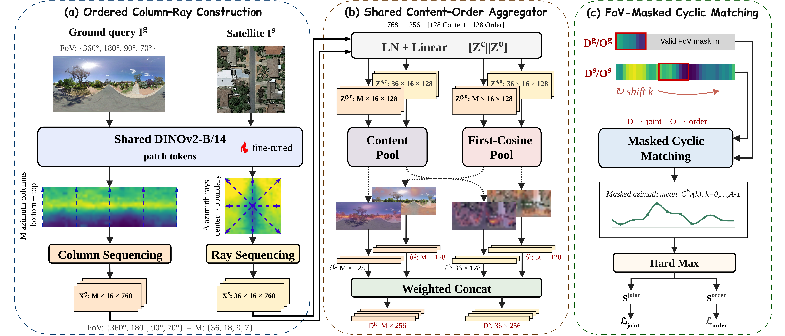

# CoR-Geo: Weakly Ordered Azimuthal Representation for Limited-FoV Cross-View Geo-Localization

Paper link : [[arXiv](https://arxiv.org/abs/XXXX.XXXXX)]

The following is the official method implementation of CoR-Geo.

## Introduction

CoR-Geo addresses limited-FoV cross-view geo-localization under unknown headings. It represents ground patch columns and satellite patch rays as weakly ordered azimuthal sequences, retaining cross-view-comparable azimuthal structure without assuming fine-grained local correspondence. A shared Content--Order aggregator with FoV-masked cyclic matching enables one model to reuse a pre-encoded satellite gallery across multiple FoVs, without heading supervision or FoV-specific training.

<p align="center">
  
</p>

## Installation

The code has been tested with:

- Linux
- Python 3.10
- PyTorch 2.3.1
- CUDA 12.1

Install CoR-Geo and its required environment with:

```bash
git clone https://github.com/Gxians/CoR-Geo.git
cd CoR-Geo

conda create -n cor_geo python=3.10 -y
conda activate cor_geo
pip install -e .
```

### DINOv2 Backbone

CoR-Geo uses the official [DINOv2](https://github.com/facebookresearch/dinov2) ViT-B/14 implementation and pretrained weights. Run:

```bash
bash scripts/setup_dinov2.sh
```

The script downloads a pinned DINOv2 source revision and the ViT-B/14 pretrained checkpoint.

## Dataset Preparation

Request CVACT and CVUSA from their respective providers and place them under `data/`. The expected directory structure and dataset access links are provided in [`data/README.md`](data/README.md).

Build the manifests and resized-image caches with:

```bash
python -m cor_geo.datasets --dataset cvact
```

Replace `cvact` with `cvusa` to prepare CVUSA.

## Usage

### Training

Train on CVACT using one GPU:

```bash
python -m cor_geo.train --dataset cvact
```

Use two GPUs for the setting reported in the paper:

```bash
python -m cor_geo.train --dataset cvact --devices 0,1
```

Replace `cvact` with `cvusa` to train on CVUSA.

Training evaluates the Val split every 8 epochs at 360°, 180°, 90°, and 70°, and selects `best.ckpt` by the four-FoV Avg. R@1. Training and validation metrics are recorded in `train_metrics.jsonl`.

To continue an interrupted run, append `--resume <checkpoint>`.

### Evaluation

Evaluate a checkpoint under random FoV crops:

```bash
python -m cor_geo.evaluate --dataset cvact
```

By default, this command evaluates `best.ckpt` with newly sampled random FoV crops. Replace `cvact` with `cvusa` for CVUSA, or use `--checkpoint last` to evaluate the latest checkpoint.

You can download the pretrained weights for cvusa and cvact here 
[CVUSA](CVACT_PRETRAINED_MODEL_URL)
, [CVACT](CVACT_PRETRAINED_MODEL_URL)

## Results

Validation Avg. R@1 over 360°, 180°, 90°, and 70° random crops:

| Dataset | Checkpoint | Avg. R@1 (%) |
|:--|:--:|--:|
| CVACT | [Pretrained model](CVACT_PRETRAINED_MODEL_URL) | 75.4 |
| CVUSA | [Pretrained model](CVUSA_PRETRAINED_MODEL_URL) | 79.8 |

## Acknowledgements

Parts of this repo are inspired by the following repositories:

[DINOv2](https://github.com/facebookresearch/dinov2)

## Citation

If you find this work useful, please consider citing:

```bibtex
@article{author2026corgeo,
  title   = {CoR-Geo: Weakly Ordered Azimuthal Representation for Limited-FoV Cross-View Geo-Localization},
  author  = {...},
  journal = {arXiv preprint arXiv:XXXX.XXXXX},
  year    = {2026}
}
```
