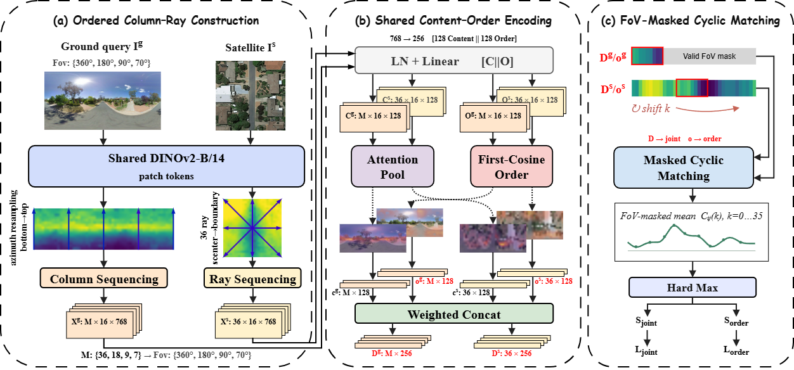

# CoR-Geo

Research implementation of **CoR-Geo: Weakly Ordered Directional
Representation for Limited-FoV Cross-View Geo-Localization**.

**Paper:** Preprint in preparation

CoR-Geo represents ground-view directions as bottom-to-top patch columns and
satellite-view directions as center-to-boundary rays. A shared Content--Order
encoder produces direction descriptors, while FoV-masked cyclic matching
searches over the unknown relative heading. One model and one pre-encoded
satellite gallery support multiple FoVs without heading supervision.



## Installation

The reported experiments used Python 3.10, PyTorch 2.3.1, CUDA 12.1, and two
NVIDIA RTX 4090 GPUs.

```bash
conda env create -f environment.yml
conda activate cor_geo
python -m pip install -e .
```

Install the pinned DINOv2 backbone:

```bash
mkdir -p third_party checkpoints/dinov2
git clone https://github.com/facebookresearch/dinov2.git third_party/dinov2
git -C third_party/dinov2 checkout 7764ea0f912e53c92e82eb78a2a1631e92725fc8
curl -L \
  https://dl.fbaipublicfiles.com/dinov2/dinov2_vitb14/dinov2_vitb14_pretrain.pth \
  -o checkpoints/dinov2/dinov2_vitb14_pretrain.pth
```

Expected SHA-256 for `dinov2_vitb14_pretrain.pth`:

```text
0b8b82f85de91b424aded121c7e1dcc2b7bc6d0adeea651bf73a13307fad8c73
```

```bash
python tools/verify_dinov2.py \
  --model-config configs/model.yaml \
  --paths configs/paths.yaml
```

## Data preparation

Download CVACT and CVUSA from their official providers and place them under
`data/`. The complete layout, expected split sizes, access terms, and integrity
commands are documented in [`data/README.md`](data/README.md).
Dataset files are not distributed by this repository.

```bash
python tools/prepare_cvact_manifests.py --dataset-config configs/cvact.yaml
python tools/verify_cvact_manifests.py --dataset-config configs/cvact.yaml

python tools/prepare_cvusa_manifests.py
python tools/verify_cvusa_manifests.py
```

## Pretrained models

Evaluation-ready checkpoints will be released after the cleaned checkpoint
bundles pass end-to-end validation.

| Training set | Download | SHA-256 |
|---|---|---|
| CVACT | To be released | -- |
| CVUSA | To be released | -- |

Each downloadable bundle should contain `config_resolved.yaml` and
`checkpoints/epoch_064.ckpt` in this layout:

```text
outputs/
├── cvact/cor_geo_cvact/
│   ├── config_resolved.yaml
│   └── checkpoints/epoch_064.ckpt
└── cvusa/cor_geo_cvusa/
    ├── config_resolved.yaml
    └── checkpoints/epoch_064.ckpt
```

## Training

The launcher builds the resized cache and runs the configured 64-epoch,
two-GPU protocol:

```bash
bash scripts/train.sh cvact
bash scripts/train.sh cvusa
```

Data remain under `data/`, resized caches under `.cache/cor_geo/`, and run
artifacts under `outputs/`. All paths are repository-relative and excluded from
Git.

## Evaluation

Evaluate with independently randomized query headings:

```bash
bash scripts/evaluate.sh cvact val epoch_064
bash scripts/evaluate.sh cvusa val epoch_064
```

`COR_GEO_GPUS` controls the visible GPUs; evaluation uses the same number of
processes. For single-GPU evaluation:

```bash
COR_GEO_GPUS=0 bash scripts/evaluate.sh cvact val epoch_064
```

Every run stores its sampled query--FoV angles and hash. Replay a retained
schedule exactly with:

```bash
COR_GEO_CROP_SCHEDULE=/path/to/random_crop_schedule.parquet \
bash scripts/evaluate.sh cvact val epoch_064
```

The evaluator uses one satellite bank for all FoVs and reports R@1, R@5,
R@10, and R@1%.

## Reported validation results

Macro R@1 is the mean R@1 over 360°, 180°, 90°, and 70° queries.

| Dataset | 360° | 180° | 90° | 70° | Macro R@1 |
|---|---:|---:|---:|---:|---:|
| CVACT | 89.7 | 84.6 | 69.0 | 58.2 | 75.4 |
| CVUSA | 95.0 | 90.0 | 72.2 | 61.9 | 79.8 |

These are validation results from one checkpoint and one recorded random-crop
draw, not averages over repeated evaluations.

## Tests

```bash
ruff check .
pytest -q
```

The unit tests do not require datasets or pretrained weights.

## Citation

Machine-readable software metadata are provided in
[`CITATION.cff`](CITATION.cff). The paper citation will be added when the
preprint is publicly available.

## License and acknowledgements

CoR-Geo source code is released under the [MIT License](LICENSE). The code in
this repository was implemented independently and does not copy or adapt source
files from another research repository. It uses
[DINOv2](https://github.com/facebookresearch/dinov2) as an external backbone
dependency, pinned to commit `7764ea0f912e53c92e82eb78a2a1631e92725fc8`.
DINOv2 and its pretrained weights remain subject to their upstream terms and
are not redistributed here. CVACT and CVUSA likewise remain subject to their
providers' terms.
